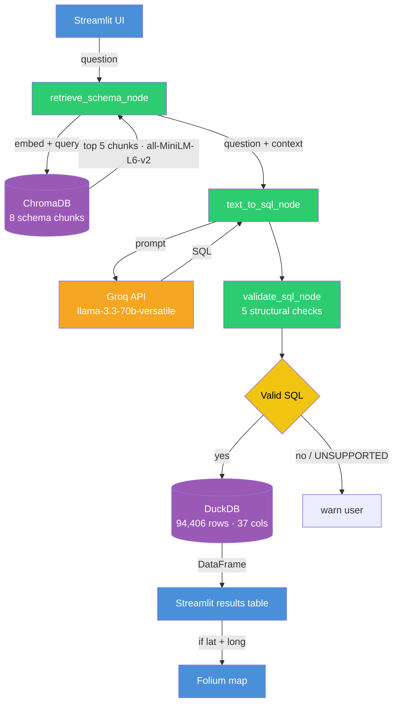

# System Architecture

---

## Layers

| Layer | Role |
|---|---|
| Streamlit UI | Accepts user question, submits to graph, renders results and map |
| LangGraph StateGraph | Orchestrates 3-node pipeline, passes `QueryState` between nodes |
| `retrieve_schema_node` | Embeds question with `all-MiniLM-L6-v2`, queries ChromaDB, returns top 5 chunks |
| `text_to_sql_node` | Injects context + full schema into prompt, calls Groq, returns SQL string |
| `validate_sql_node` | Runs 5 structural checks before any database call |
| DuckDB | Executes validated SQL against `collisions_clean` (94,406 rows, 37 columns) |
| ChromaDB | In-memory collection of 8 schema chunk embeddings |
| Groq API | Hosts `llama-3.3-70b-versatile` for SQL generation |
| Folium Map | Renders collision locations when result contains `lat`/`long` columns |
